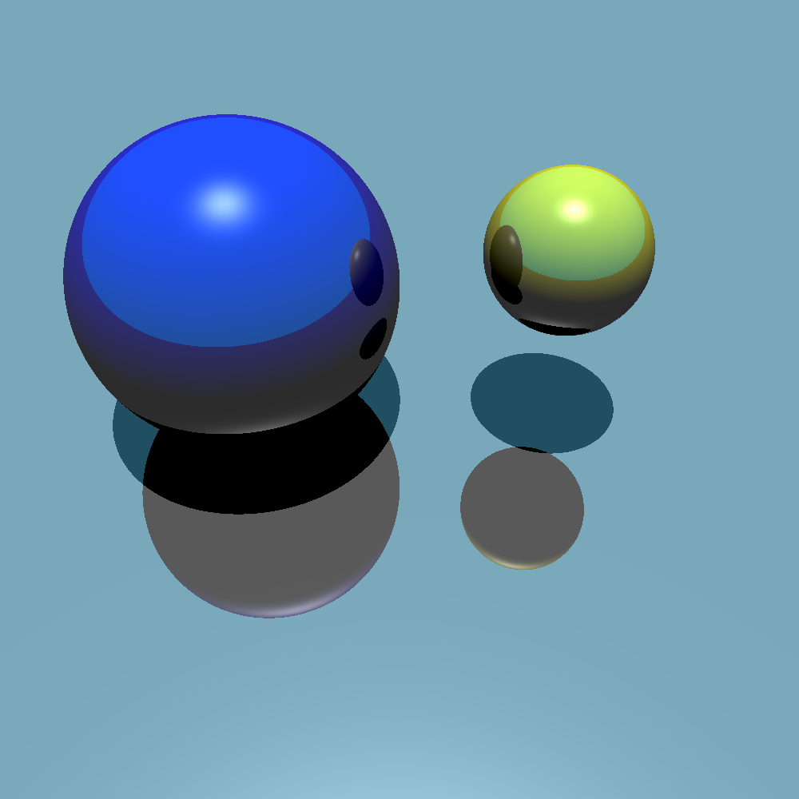

# Python Ray Tracing Project

This is a Python project for ray tracing, a technique used in computer graphics to generate an image by tracing the path of light takes, interaction with different objects and materials. This project provides a basic implementation of ray tracing using Python and NumPy. Diffusive and specular effects are available, as well as reflections. Currently, only spheres are implemented.

<p align="center">

</p>

## Overview

The project consists of several Python files:

- `main.py`: The main file that initiates the ray tracing process.
- `constants.py`: Contains constant values used throughout the project.
- `objects.py`: Defines classes for geometric objects like spheres and light sources.
- `player.py`: Defines the player's viewpoint and screen.
- `materials.py`: Defines material properties used for shading objects.
- `screen.py`: Defines the screen class for generating the final image.

## Dependencies
- `numpy`
- `matplotlib`

## Usage

To run the ray tracing simulation and generate an image, simply execute the `main.py` file:

```
python main.py
```

You can define your own objects, light sources and materials in the `main.py` to suit your needs.
