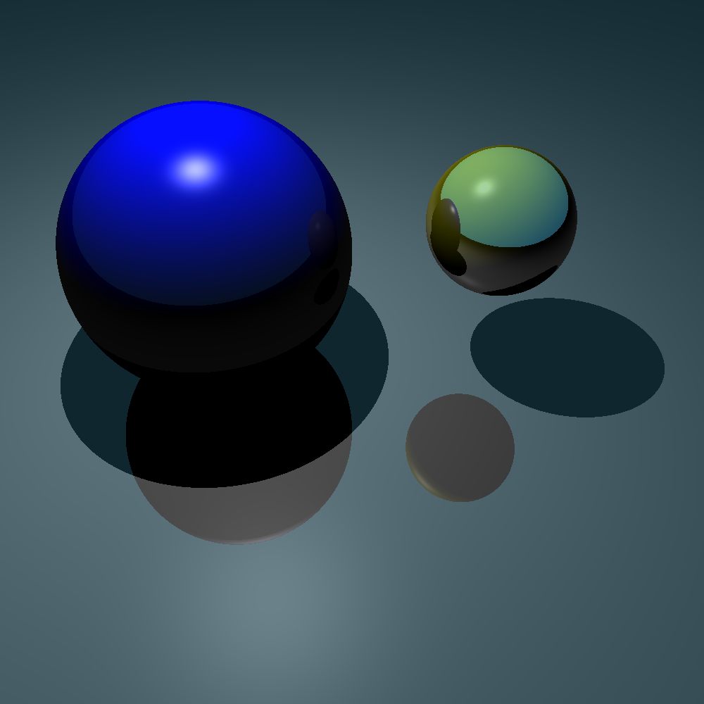
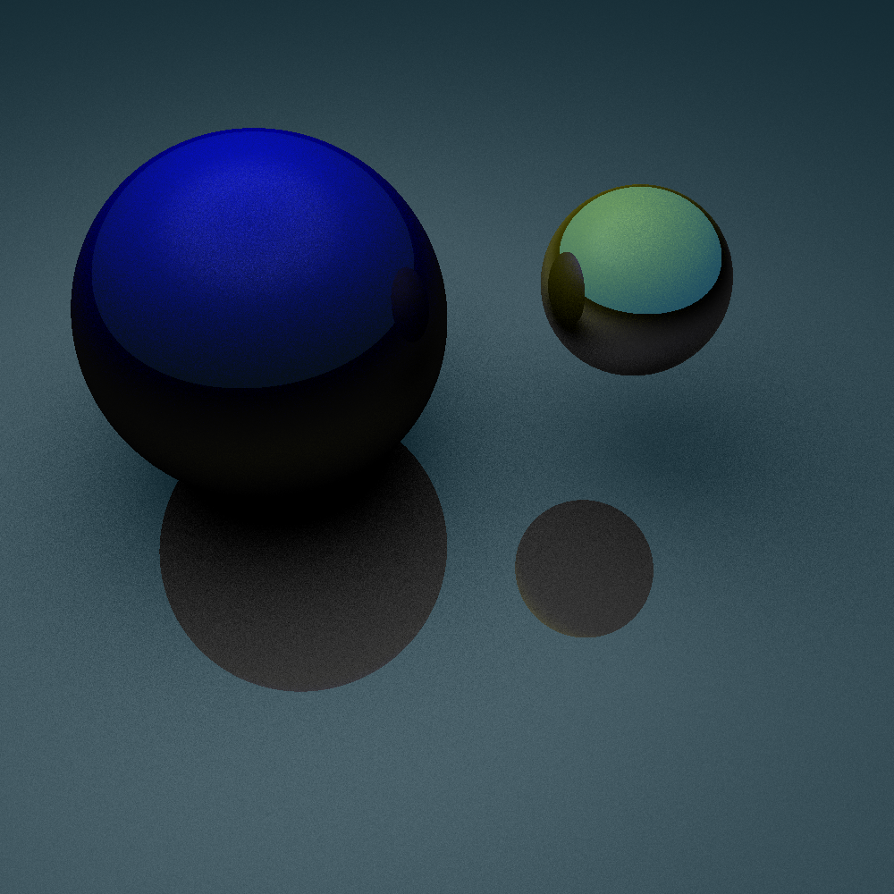
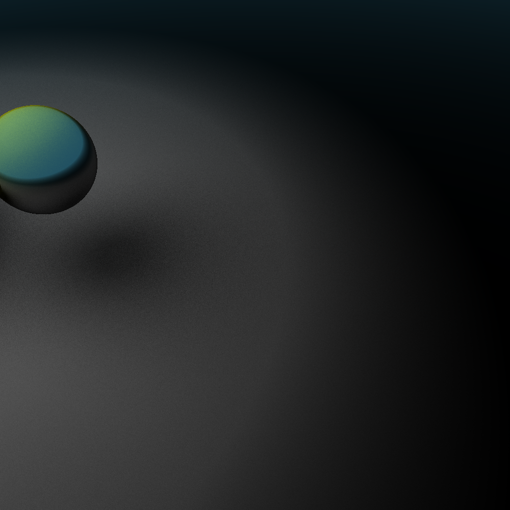
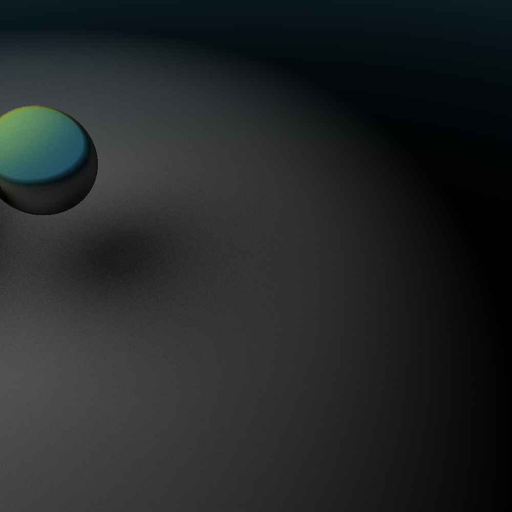
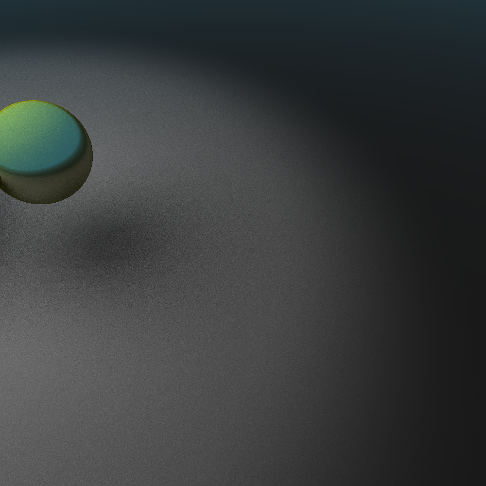
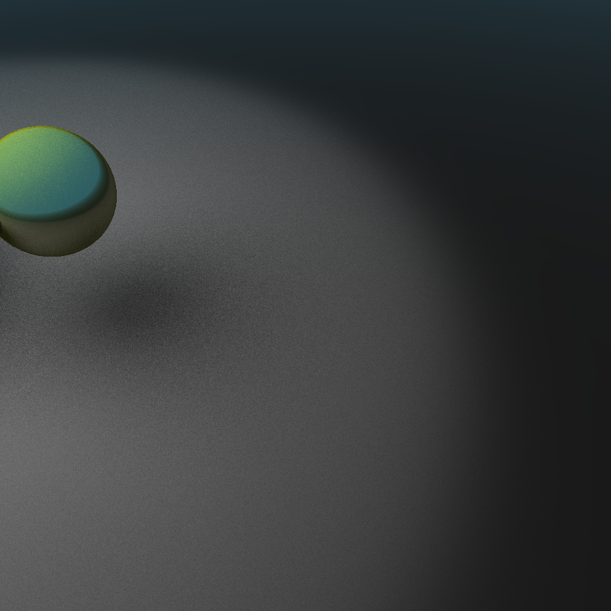

# Python Ray Tracing Project

This is a Python project for ray tracing, a technique used in computer graphics to generate an image by tracing the path light takes, interacting with different objects and materials. This project provides a basic implementation of ray tracing using Python and NumPy. Materials can have diffusive, specular, and reflective properties are available. Currently, only spheres are implemented. Additionally, two different types of light sources have been implemented: a point light source and a disk light source. Furthermore, each light-source has a directional variant, function similarly to a spot-light. The directional light sources has multiple possible types of options for easing the edge of the lightbeam.


### Example scene
Below is an example scene, using the different kinds light sources.


|  |  |
|:--------------------------------------------:|:------------------------------------------:|
|                 Point source                 |           Disk light source <br>           |  

|  |      |
|:------------------------------------------:|:----------------------------------------------------:|
|               Linear easing                |                   Quadratic easing                   |
|    |  |
|                Cubic easing                |                  Exponential easing                  |


## Overview

The project consists of several Python files, including:

- `main.py`: The main file that initiates the ray tracing process.
- `objects.py`: Defines classes for objects like the camera, screen, geometric shapes, and light sources.
  - Additional shapes and light sources can be added here
- `materials.py`: Defines material properties used for shading objects.
  - Additional material properties can be added for increased realism.

## Overview

The project consists of several Python files, organized as follows:

- `main.py`: Entry-point for running the code.
- `constants.py`: Constants defining colors, the size of the image etc.
- `non_vectorized/`: Contains the non-vectorized version of the ray tracing implementation.
  - `raytrace.py`: Implements ray tracing algorithms using non-vectorized operations.
  - `materials.py`: Implements materials.
  - `objects.py`: Implements scene objects.
- `vectorized/`: Contains the vectorized version of the ray tracing implementation.
  - `raytrace.py`: Implements ray tracing algorithms using vectorized operations.
  - `materials.py`: Implements materials that supports vectorized operations.
  - `objects.py`: Implements scene objects in a way that supports vectorized operations.

## Dependencies
- `numpy`
- `matplotlib`

## Usage

To run the ray tracing simulation and generate an image, simply execute the `main.py` file:

```
python main.py
```

You can define your own objects, light sources and materials in `objects.py`, and `materials.py` to suit your needs.
