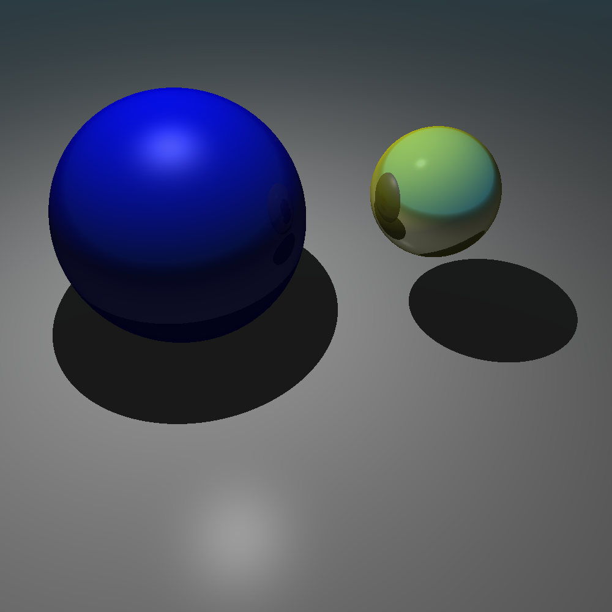
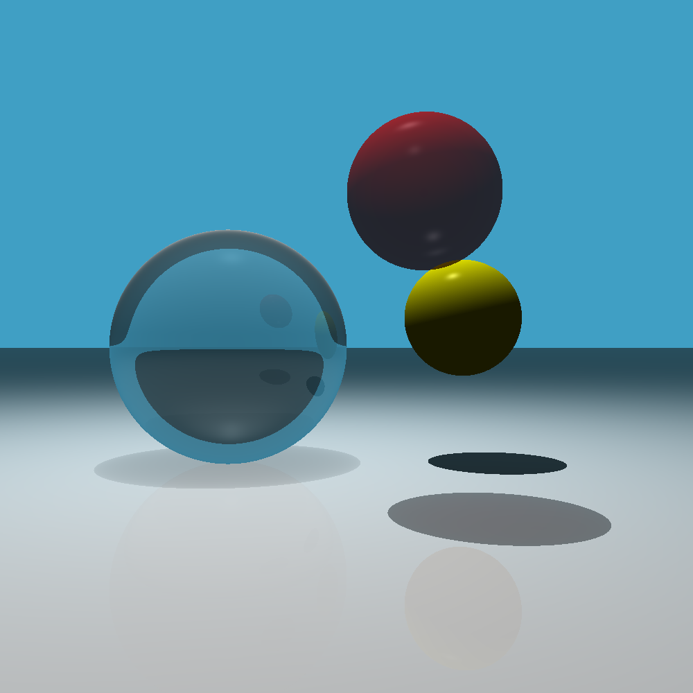
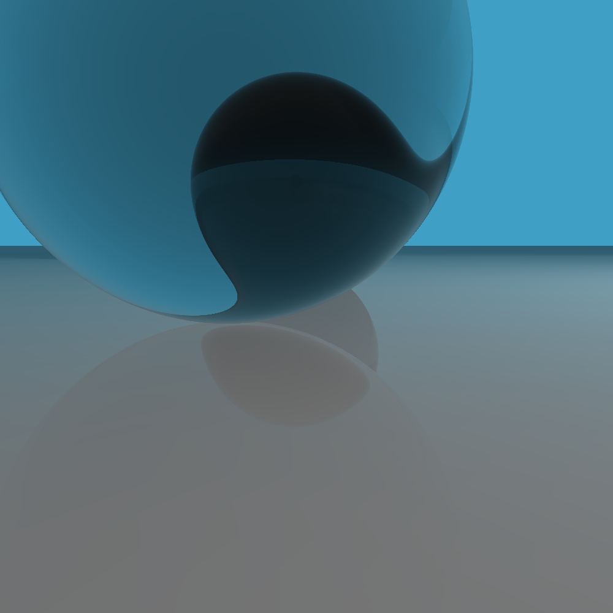
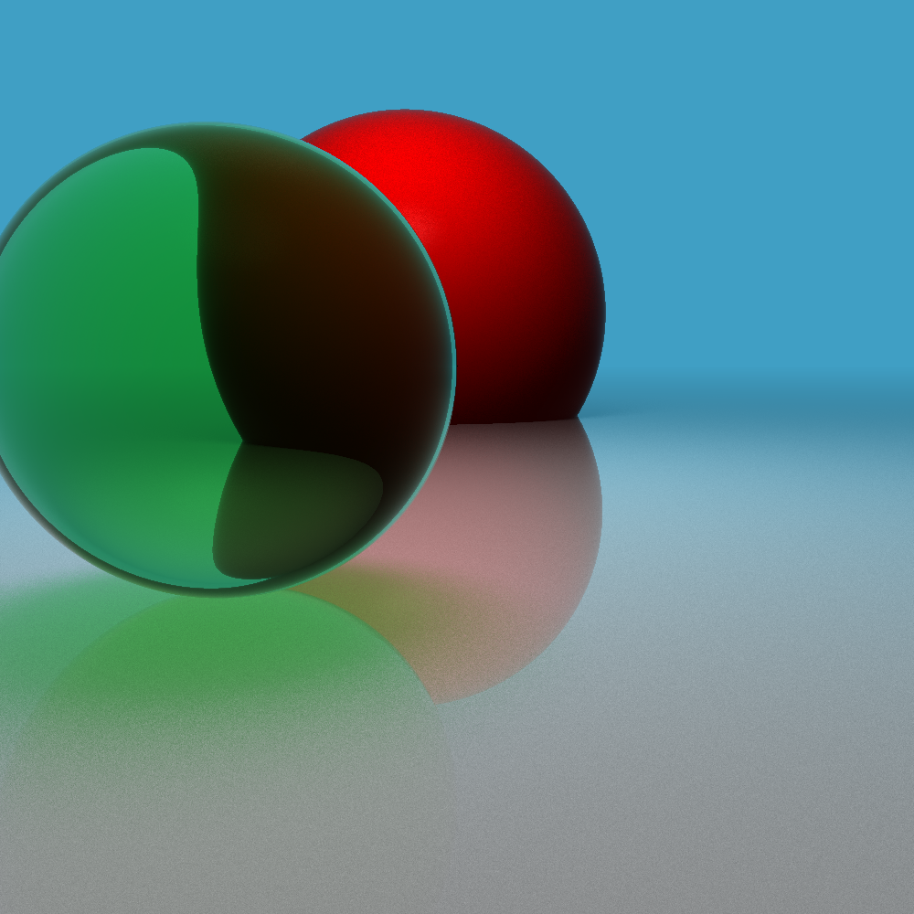
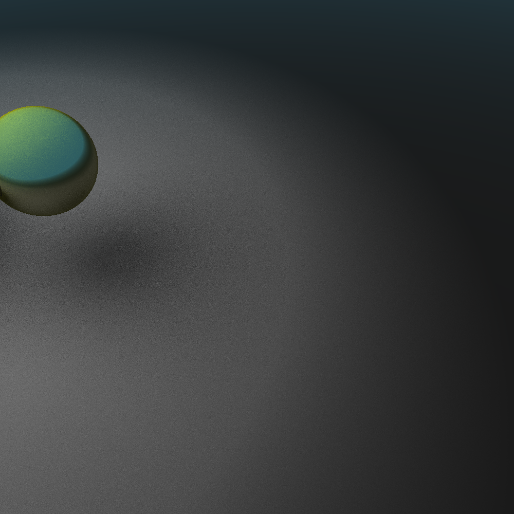
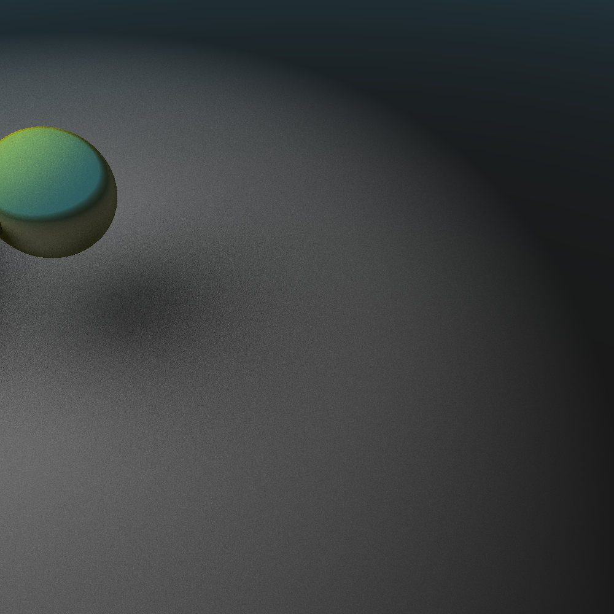

# Python Ray Tracing Project

This is a Python project for ray tracing, a technique used in computer graphics to generate an image by tracing the path light takes, interacting with different objects and materials. This project provides a basic implementation of ray tracing using Python and NumPy. Materials can have diffusive, specular, properties. Furthermore, objects can also be reflective and transparent, with customizable refractive indices. Spheres, planes, squares, triangles, and unions of these objects have been implemented. Additionally, two different types of light sources have been implemented: a point light source and a disk light source. Furthermore, each light source has a directional variant, function similarly to a spotlight. The directional light sources has multiple possible types of options for easing the edge of the lightbeam.


### Example scene
Below are four different an example scenes, showcasing the different material types and light sources.


|  |  |
|:----------------------------------:|:----------------------------------:|
|             Example 1              |             Example 2              |
|  |  |
|             Example 3              |             Example 4              |
|  |
|             Example 5              |


#### Directional disk light source and different easing modes:

|  |      |
|:------------------------------------------:|:----------------------------------------------------:|
|               Linear easing                |                   Quadratic easing                   |
|    |  |
|                Cubic easing                |                  Exponential easing                  |


## Overview

The project consists of several Python files, including:

- `main.py`: The main file that initiates the ray tracing process.
- `objects.py`: Defines classes for objects like the camera, screen, geometric shapes, and light sources.
  - Additional shapes and light sources can be added here
- `materials.py`: Defines material properties used for shading objects.
  - Additional material properties can be added for increased realism.

## Overview

The project consists of several Python files, organized as follows:

- `main.py`: Entry-point for running the code.
- `constants.py`: Constants defining colors, the size of the image etc.
- `raytrace.py`: Implements the ray tracing algorithm.
- `materials.py`: Implements materials.
- `objects.py`: Implements scene objects, for example spheres.

## Dependencies
- `numpy`
- `matplotlib`

Install by running the following command in the terminal:

```
pip install -r requirements.txt
```

## Usage

To run the ray tracing simulation and generate an image, simply execute the `main.py` file:

```
python main.py
```

You can define your own objects, light sources and materials in `objects.py`, and `materials.py` to suit your needs.

### Notes

This project does not explicitly support objects intersecting other objects, and can result in inaccurate results in regard to transparent and refractive materials. As a consequence of this fact, plane objects should only have a refractive index equal to 1.